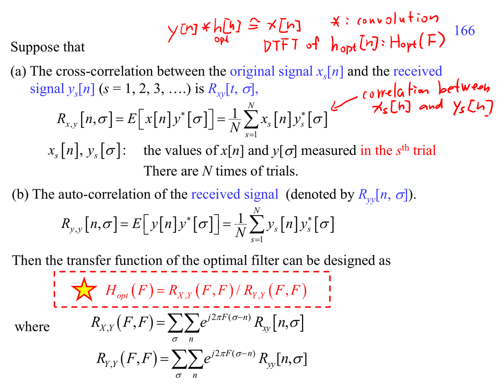

# Wiener filter

Wiener filter 假設 signal/noise 有統計模型，用 MSE 最小化得到最佳 linear estimator。這裡需要 [[Probability for random signals]]：expectation、autocorrelation、power spectrum 都會進來。

## 深入解說

這一群是「常用 filter 的任務導向地圖」。不要先背 filter 名稱，先看它在資料裡要消掉或保留什麼：notch filter 消掉窄頻干擾，smoother 壓高頻雜訊，Hilbert transform 產生 analytic signal 或 90-degree phase shift，edge detector 強調局部差分，matched filter 對已知 pattern 最大化 SNR，Wiener filter 用統計模型折衷 signal/noise，equalizer 補償 channel distortion。每篇都應該連回 [[Frequency response]]、[[Convolution]]、[[Optimization norm for filter design]]，因為 filter 的行為不是看係數漂亮不漂亮，而是看它對頻率、noise、delay、和訊號模型的 effect。

## 對你目前程度的讀法

先把這篇放回 [[Frequency response]] 和 [[Probability for random signals]]。如果公式看起來突然跳太快，先不要急著背結論；把每個 symbol 的 role 寫在旁邊：它是 sample index、frequency variable、filter coefficient、random variable，還是 matrix/vector component。ADSP 很多困難其實不是微積分技巧，而是 notation 在 time domain、frequency domain、Z-domain、matrix domain 之間切換。

## 公式和講義圖怎麼讀

讀 filter 圖時先找 input/output relation：$y[n]=x[n]*h[n]$ 是 filtering；若 filter 依賴 signal/noise statistics，就會出現 $E[\cdot]$、correlation 或 spectrum ratio；若是 detection，就會出現 template、delay、SNR。

## 常見卡點

- 把 DFT bin 當成連續頻率，會誤讀頻譜解析度與 aliasing。
- 只看 magnitude 不看 phase，會漏掉 delay、linear phase、minimum phase、cepstrum inverse 等問題。
- 把 optimal 當成絕對最好；其實 optimal 永遠相對於 chosen model、norm、constraint。
- 忘記 implementation cost；ADSP 後半的 fast algorithms 會一直追問同一個數學結果能不能更有效率地算。

## 自我檢查

能不能用一句話說這個 filter 的任務？它依賴 deterministic template、frequency notch，還是 statistical model？如果 noise 變大，它會怎麼失效？

## 相關筆記

- [[Advanced digital signal processing]]
- [[ADSP math prerequisites MOC]]
- [[Frequency response]] 和 [[Probability for random signals]]

## 講義截圖

