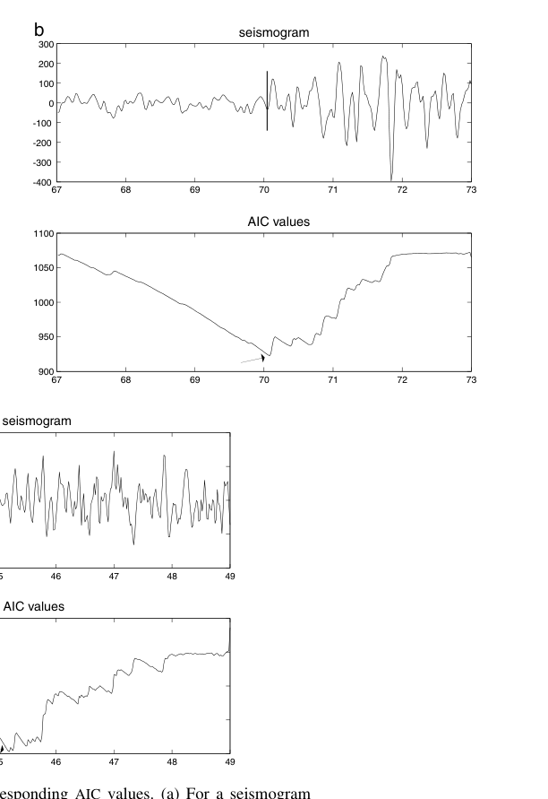

# Zhang Thurber Rowe 2003 wavelet AIC P-wave picking

這篇可以作為 seismic project 的 main technical improvement：用 wavelet representation 讓 AIC picking 更 robust。

## Method In Words

傳統 [[AIC picker]] 在 noisy single-component recording 中容易受 window 和 local noise 影響。Zhang, Thurber, and Rowe 的思路是先用 [[Wavelet transform for seismic picking]] 建立 multiscale representation，再在不同 scale 上做 AIC picking。真正可信的 P-wave onset 應在多個 scale 附近一致，而不是只在某個 noisy trace 上偶然出現 minimum。

## ADSP Course Connection

這篇連到 nonstationary signal representation。wavelet step 是 representation，AIC step 是 decision rule；兩者合起來就是 ADSP detector design。

## Mathematical Statistics Connection

AIC step 連到 [[Akaike information criterion]]、[[Likelihood function]]、[[Change point detection]]。wavelet step 則偏 signal representation，不需要硬連數統。

這張圖放在 AIC baseline 小節，說明 AIC minimum 對應 estimated onset。文字要補上：minimum 的位置來自前後兩段 statistical model 的分割成本，而不是單純 amplitude 最大點。

這張圖放在 multiscale 小節，說明 wavelet-AIC 的關鍵 evidence 是跨尺度一致性。若多個 scale 的 pick 聚在一起，可主張 robustness 提升。

## Links

- [[AIC picker]]
- [[Akaike information criterion]]
- [[Change point detection]]
- [[Wavelet transform for seismic picking]]
- [[Short-time Fourier transform]]
- [[Spectral analysis workflow]]
- [[Seismic wave detection as ADSP]]
- [[Seismic wave signal processing project]]
