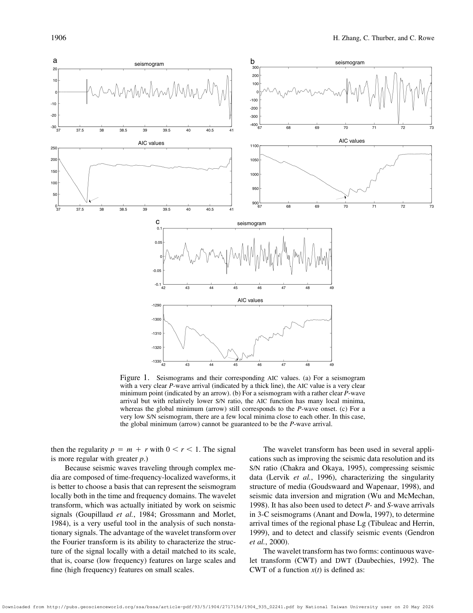

# Zhang Thurber Rowe 2003 wavelet AIC P-wave picking

這篇把 [[Wavelet transform for seismic picking]] 和 [[AIC picker]] 結合，用於 single-component recordings 的 P-wave arrival detection/picking。

核心想法：

- Wavelet coefficients 在高 resolution 保留細節，在低 resolution 表示 coarse features。
- 真正的 P-wave arrival 應該跨多個 scale 穩定出現；scattered arrivals 或 noise 較容易在低 resolution 消失。
- 在 sliding windows 中對 thresholded absolute wavelet coefficients 套 AIC picker，再檢查不同 scale 的 pick consistency。

報告可用比較角度：

- 相比純 STA/LTA，wavelet-AIC 更適合 low SNR 或 onset 不明顯的情況。
- 相比純 AIC，multiscale consistency 可降低單一 window/local minimum 的不穩定。
- 缺點是參數較多：wavelet family、scale、threshold、window length 都會影響結果。

## 論文圖表截圖

